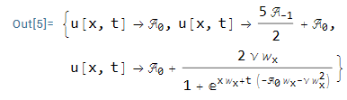
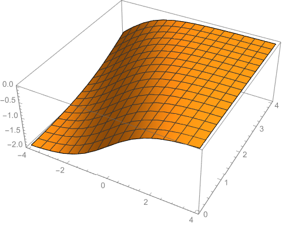

# GERFSOLVE

is a Mathematica paclet that solves nonlinear integral order partial differential equations using the GERF (generalized exponential rational function) expansion technique. For more info on the method, see [10.1016/j.rinp.2023.106298](https://doi.org/10.1016/j.rinp.2023.106298). To learn more about the paclet, visit the homepage at Wolfram repository: [https://resources.wolframcloud.com/PacletRepository/resources/Taggar/GERF/](https://resources.wolframcloud.com/PacletRepository/resources/Taggar/GERF/)

To install the package, run

```mathematica
PacletInstall["Taggar/GERF"]
```

Then, load it with

```mathematica
<<Taggar`GERF`
```

### Usage

Let

```mathematica
burgers = Derivative[0, 1][u][x, t] + u[x, t]*Derivative[1, 0][u][x, t] - ?*Derivative[2, 0][u][x, t] == 0
```

be the given equation (this is the Burgers' equation in (1+1)-dimensions). Then, use GERFSolve as follows:

```mathematica
sol = GERFSolve[burgers, u[x,t]]
```

which returns the following output:



Pick any of these and plot it for appropriate values:

```mathematica
Plot3D[
u[x,t] /. sol[[3]] /. {...},
{x,-20,20},{y,-20,20}]
```
